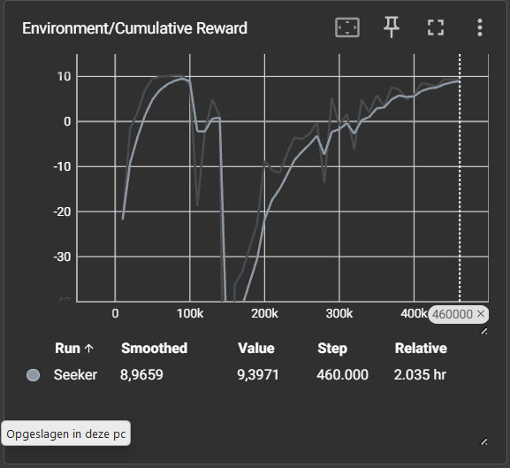
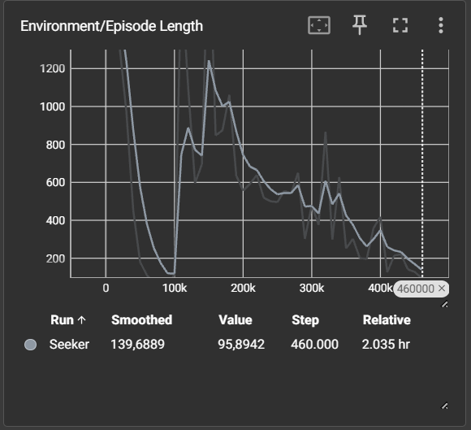
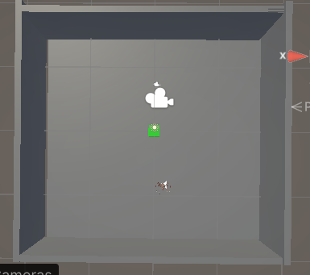
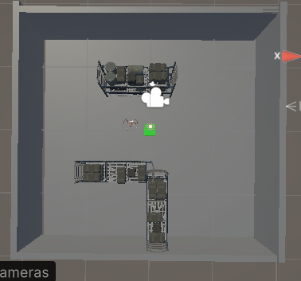
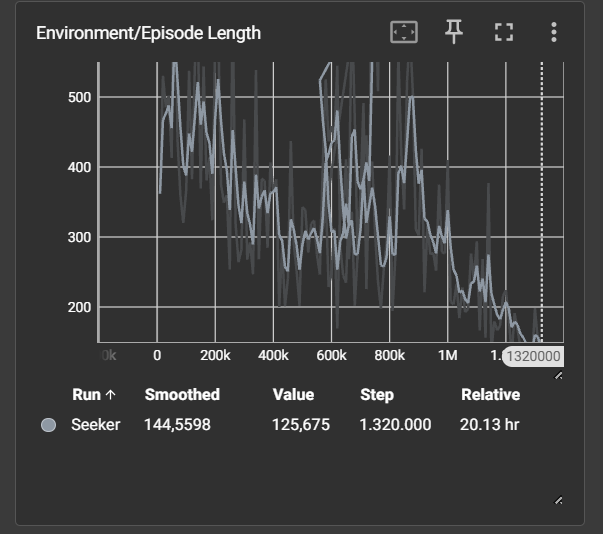
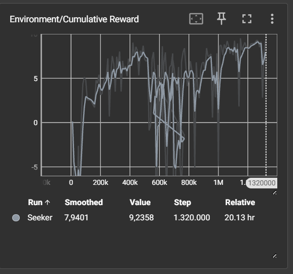
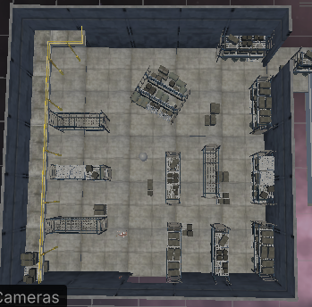
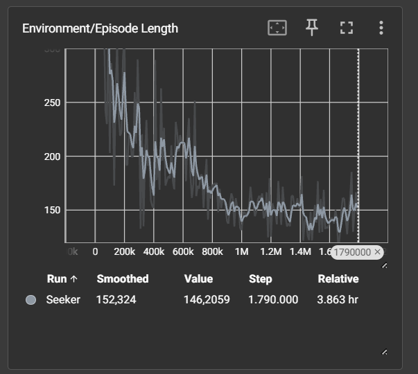
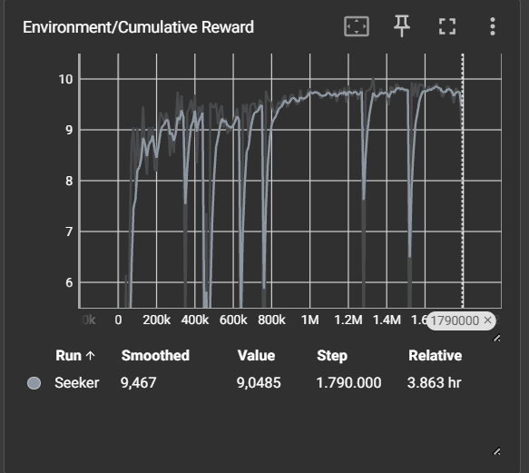

# Space escape

## Inleiding
Je bent een mens op een ruimteship tot er plots een metoriet tegen het schip aanvliegt en alls verandert in een grote nachtmerrie, je wordt wakker in de controle kamer in een verwoest schip met het onbekende voorbij de deur.

## Samenvatting
In deze tutorial zal er over de verschillende hoofd features een basis uitleg gegeven worden hoe deze werken en hoe de finale Agent tot zijn werking is bekomen.

## Methode
- Installaties: 1. conda env: torch 1.7.1, mlagents=0.30.0, 
2. python env: onnxconvertor-common(1.16.0), installatie: pip install onnxconverter-common [voor het converteren van een 32bit model naar een simpeler makkelijker draaiend fp16 model]

Verloop:
#### Spelers perspectief:
1. Speler start in controle kamer.
2. Speler zoekt een keycard om deur te openen.
3. Speler gaat naar de opslagruimte voor een lamp te zoeken.
4. Agent spawned in en kan speler aanvallen.
5. Speler zoekt in de opslagruimte naar de keycard.
6. Speler gaat naar volgende ruimte met deze keycard.
7. Speler ziet verschillende monitors in de server ruimte met getallen die hij kan gebruiken bij een numpad in de observatie ruimte.
8. peler gaat deze nummers ingeven op de numpad in de observatieruimte.
9. Als laatste moet de speler de Agent verslaan, hiervoor moet hij een serum maken en het wapen nemen.

* volgende stappen kunnen in wilkeurige volgorde

--------------------------------------------------------
10. speler neemt wapen
11. speler gaat het serum maken
--------------------------------------------------------
12. Speler giet serum over kogel
13. speler dood Agent
14. Gewonnen

#### Agent perspectief
1. Speler heeft lamp en Agent spawned in.
2. Agent zoekt achter speler en achtervolgt als hij hen ziet.
3. Als speler keycard heeft en naar volgende ruimte gaat, activeer unity ingebouwde nav agent naar de volgende ruimte.
* loop
------
4. navigeer naar de verschillende ruimtes en als de ruimte wordt bereikt verander dan terug naar  eigen getrainde ML agent.
------

- * Observaties: 3D ray perception, Agent velocity

* acties: Draaien, voorwaarts & achterwaarts bewegen

* beloningen: Hider vinden(10f), dichter tot bij hider komen(0.05f x afstad hider)
* Afstraffingen: tijd nemen(-0.001f= vareerend doorheen de training), muur contact(-0.5f), obstacle contact(veel te langer tegenaan obstakel veel te meer negative reward)

- Beschrijving project
### Beschrijving van de objecten

#### Ruimtes

- **Controle kamer**: Startlocatie van de speler. Bevat de nodige informatie om het spel te starten.
- **Opslagkamer**: Ruimte waar de speler items kan vinden zoals een lamp een keycard en een wapen.
- **Serverruimte (x2)**: Twee ruimtes met monitors die getallen tonen, deze zijn bruikbaar bij de numpad in de observatieruimte.
- **Observatieruimte**: Bevat een numpad waarop de speler de correcte code moet ingeven.
- **Labo**: Ruimte waar de speler het serum kan aanmaken.

#### Items

- **Keycard (x3)**: Ontgrendelt afgesloten deuren tussen de ruimtes.
- **Lamp**: Item dat de speler nodig heeft om verder te gaan.
- **Serum**: Aangemaakt in het labo, noodzakelijk om de alien te verslaan.
- **Wapen**: Gebruikt in combinatie met het serum om de alien te doden.

#### Personages

- **Speler**: Hoofdpersoon, bestuurd door de speler in VR.
- **Alien (Agent)**: Een alien die als ML-Agent getraind is omde speler op te sporen en aan te vallen.

- one pager:

------

# Space escape (Horror/immersive enviroment)

## Team
Haast Jelle, Spruyt Sem

## Concept
Je zweeft met je groep door de ruimte in je schip wanneer er iets onbekend op de radar verschijnt op de vlieg route van je schip. Na de crash is er iets onbekend aan boord en je groep is nergens meer te vinden, vind je groepsleden en een manier om te ontsnappen van het schip voordat je gevangen wordt door wat er ook aan boord je schip is.

## "Draaiboek"

De speler start in een de bestuurderskamer van het schip, er verschijnt iets op het scherm dat niet te identificeren valt. Er is een crash met het object (scherm zwart), speler wordt wakker in het donkere schip wat al beschadigingen heeft gekregen van het onidentificeerbare wezen. De speler zal opzoek moeten gaan naar zijn mede collega's (als deze nog leven) en naar items voor de "escape pod" om zo het spel te kunnen voltooien.

## Gameplay
- Sluipen en schuilen in je omgeving.
- Ontdek de kamers van het ship en vind de nodige items.
- Gebruik maken van eenvoudige puzzels via omgevings interactie.
- Spanningsopbouw door gebruik van geluid en licht.

## Opbouw AI
De alien zal getrained worden via meerdere iteraties en curriculum-learning(= eenvoudig naar moeilijk).

Het doel is dat de gangen als een soort patrouille route te laten dienen via de ingebouwde nav-agent van unity en als er dan bijvoorbeeld een trigger(geluid, oppakken van mission item) gebeurd dan zal deze naar de kamer waar deze voorgekomen is navigeren en dan zal de nav-agent worden uitgeschakeld en zal deze de ruimte doorzoeken gebruik makend van onze eigen getrainde ML-agent over een bepaalde tijd.

## Setting & sfeer

- sci-fi ruimteschip en een crisis toestand
- donkere gangen en kamers met minimale belichting
- geluids design zal belangrijk zijn aangezien dit de hoofd drijver is naar een spannende ervaring.
- het gevoel creëren dat je alleen met dit wezen zit opgeloten.

## Doel

Een immersieve horrorervaring creëren in de diepte van de ruimte waar de speler zich constant opgejaagd zal voelen. De eigen getrainde ML-Agent zal een gevoel van onbekendheid/stress creëren aangezien je niet weet waar deze zich naar gaat begeven in de ruimte. Via VR kunnen we het maken dat de speler actief in plekken kan schuilen en kan gaan bukken om onder objecten door te raken.

## Innovatie
###  Waarom AI
- Een ML-Agent die zelf heeft getrained achter een speler te zoeken.
- De AI is een "single agent" waar de schuiler (speler) tegen moet spelen.
- Dynamisch gedrag in een horror setting.
- Nadeel: 
1. Moeilijk om te trainen voor over gangen te lopen/echt goede navigatie te doen wat deze te makkelijk maakt. 
2. De speler zal nooit echt van de vele verschillende patronen kunnen leren waardoor een level misschien te moeilijk/onmogelijk kan worden.
- Voordelen: 
1. Echt bijna gestructureerd "random" gedrag wat het goed maakt voor herspeelbaarheid/verrassingen.

#### Wat als zonder AI?=>
- voorgelegde routes.
- voorspelbaar.

- voordeel: echt random ML-Agent gedrag kan misschien te moeilijk/onmogelijk worden.
- nadeel: als de speler genoeg opnieuw speelt zal deze de acties kunnen voorspellen =>kan ervoor zorgen dat een spel juist saai wordt.

### Waarom VR
- actief bukken om te kunnen verstoppen.
- Een interactieve omgeving.
- trekt je meer in het verhaal/gameplay (meer spanning opbouw).
- (interactie met deuren)
- het oprapen van de missie items

### interactie
- de speler kan door met zijn hand naar missie item + grip-click een item missie item oprapen.
- de speler kan door met zijn hand naar missie item + grip-click een deur openen.
- Door fysiek te bukken kan de speler onder objecten bewegen en schuilen.
- interactie vooral omgevings gebonden houden zonder te veel gebruikt van de knoppen buiten de grip knop van de controller.

-----

- Over het algemeen lijkt het dat er weinig afgeweken is van de one pager, er is een vrij realistisch haalbaar doel weggezet dat we behaald hebben met deze opracht, er was ook al een deel ervaring inverband met de limitaties van en en daarom was de ingebouwde nav agent aan bod gekomen.
Wel in de kleine details zijn er dingen minder goed gingen/ moeilijker waren dan dat ik verwacht, zoals deuren zijn we voor schuif deuren gegaan en ook bijvoorbeeld het trainen van de AI was toch nog moeilijker dan verwacht om goed te krijgen.

## Resultaten (agent)

## Conclusie
samenvatting: Een immersieve omgeving in een ruimteschip waar je via deuren te openen en kleine puzzels op te lossen een Alien moet ontsnappen.

resultaten: De agent leerde de speler vlot opsporen na voldoende traingstijd en het juist afstemmen van het curriculum-learning. Over het algemeen werkt hij in meerdere omgevingen maar soms kunnen er kleine struikeblokken zijn waar we de omgeving moeten af stemmen op de agent.

Run1(Lege omgeving):

Aangezien het snappen van rond bewegen tot ik moet deze kubus met de hider oprapen snel bereikt wordt Zetten we de training direct verder in de basic scene hier geven we de seeker twee extra complexe taken, eerst had ik het open schap in het midden van het speelveld gezet met de hider hier achter en kort erna (aangezien deze verandering niet moeilijk genoeg was) heb ik de afgesloten hoek met de hider/seeker die hier achter spawned. Dit zorgt voor twee grote gedragsveranderingen. Hij leert ontsnappen uit nouw benepen hoeken en ook leert hij van door nouwere doorgangen te bewegen om zijn doel te bereieken. (Deze scene verandering kunnen we zien aan de grote neerval in reward en de sterke steiging van de episode tijd)

Run2(geavanceerde omgeving):

In run2 wordt er geinisialiseert vanaf run1 om het basis gedrag van object awarness en het zoeken van de hider over te nemen in de complexere omgeving.

De omgeving is moeilijker en moeilijker gemaakt tot aan de finale afbeelding die hier te zien is over de training heen. Doordat de omgeving veranderde en er geen vaste hider positie was, Kunnen we veel pieken en dallen zien tot wanneer deze beginnen af te vlakken in het correcte gedrag.

De inspringen die we zien rond de 600k stappen was omdat ik vanaf hier de agent heb terug gezet naar de 500k checkpoint aangezien de agent in de mist begon te lopen aan de 600K stappen.

Run3(fine tuning):

Zelfde trainings omgeving als Run2

Aangezien ik geobserveerd had dat de agent nog niet super goed in sommige hoeken terecht kan komen heb ik extra "edge cases" voorzien waarop deze meer betrouwbaar kan rond zoeken. dit kunnen kan geobserveerd warden aan de grote dallen (moeilijke edge cases) en hoe deze een groot deel minder voorkomen over tijd. Eventuele extra training per kamer waarin deze zich zal bewegen zou nog betere resultaten hebben kunnen geven in het finale project maar over het algemeen is de generalisatie over meerdere kamers met de juiste tags al redelijk goed.

Persoonlijke visie: We zien de resultaten veel springen en dan beginnen stabiliseren dit komt overeen met het verwachte gedrag aangezien de omgeving complex en veranderlijk was en de seeker enkel op ray perception en zijn eigen velocity als observaties werkt. Dit zorgt ervoor dat er lange training verwacht wordt met hoge varieteit en grote sprongen in rewards en episode lengte.

Verbeteringen: Eventuele extra fine tune traingen per omgeving zodat de seeker hierbinnen beter kan navigeren. Een eventuele sprint functie had ook wel interessant geweest als de speler bijvoorbeeld aan het lopen was en dat dan de locatie van het geluid als observatie doorgegeven wordt en de seeker zich zo snel mogelijk tot de speler begeeft.

## Bronnen

#### Code, optimalisatie en algemene guides

Valem Tutorials. (2024, February 25). Learn VR development in 3 hours - Unity VR tutorial complete course [Video]. YouTube. https://www.youtube.com/watch?v=YBQ_ps6e71k

Nerd Head. (2022, April 27). Use occlusion culling like a PRO | Unity advanced tutorial [Video]. YouTube. https://www.youtube.com/watch?v=hv2CUi2eeBY

Anthropic. (2026). Claude (claude-sonnet-4-6) [Large language model]. https://claude.ai

Assets (Tools):
Unity Technologies. (2025). XR Interaction Toolkit (Version 3.3.1) [Software package]. Unity Package Manager. 

Unity Technologies. (2026). ML Agents (Version 4.0.3) [Software package]. Unity Package Manager. 

#### Assets (3D)
juanjo_sound (2025). Backrooms Entity Sound Effects [Unity asset]. Unity Asset Store. https://assetstore.unity.com/packages/audio/sound-fx/backrooms-entity-sound-effects-324400

Animatrics Studio (2025). Chemistry Lab Item Pack [Unity asset]. Unity Asset Store. https://assetstore.unity.com/packages/3d/environments/chemistry-lab-items-pack-220212

Terresquall (2025). Free Sci-Fi Office Pack [Unity asset]. Unity Asset Store. https://assetstore.unity.com/packages/3d/environments/sci-fi/free-sci-fi-office-pack-195067

Navarone (2025). Keypad FREE [Unity asset]. Unity Asset Store. https://assetstore.unity.com/packages/p/keypad-free-262151

Panchenko Lyudmila (2025). Monster Mutant 7 [Unity asset]. Unity Asset Store. https://assetstore.unity.com/packages/3d/characters/creatures/monster-mutant-7-188552

Daniel Kole Productions (2025). MSFMC - Radar Dish [Unity asset]. Unity Asset Store. https://assetstore.unity.com/packages/3d/environments/sci-fi/msfmc-radar-dish-52701

Chris Nolet (2025). Quick Outline [Unity asset]. Unity Asset Store. https://assetstore.unity.com/packages/tools/particles-effects/quick-outline-115488

MASH Virtual (2025). Sci fi Access Machine [Unity asset]. Unity Asset Store. https://assetstore.unity.com/packages/3d/environments/sci-fi/sci-fi-access-machine-162924

Sickhead Games (2020). Sci-Fi Construction Kit (Modular) [Unity asset]. Unity Asset Store. https://assetstore.unity.com/packages/3d/environments/sci-fi/sci-fi-construction-kit-modular-159280

Robson Cozendey (2023). Sci-Fi Music Loops Pack [Unity asset]. Unity Asset Store. https://assetstore.unity.com/packages/audio/music/electronic/sci-fi-music-loops-pack-120186

PULSAR BYTES (2017). Starfield Skybox [Unity asset]. Unity Asset Store. https://assetstore.unity.com/packages/2d/textures-materials/sky/starfield-skybox-92717

PolyOne Studio (2025). Weapons Pack - Bullets [Unity asset]. Unity Asset Store. https://assetstore.unity.com/packages/3d/props/weapons/weapons-pack-bullets-302702

